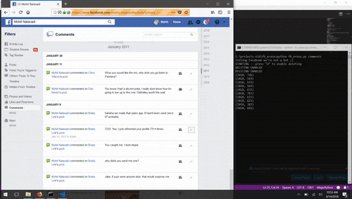
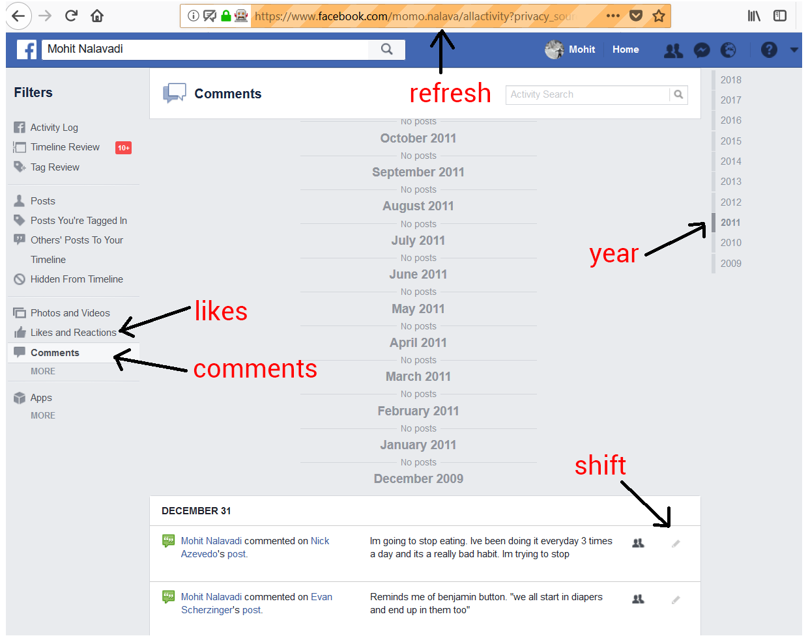

# Facebook Eraser

In light of the recent Facebook controveries, I built an application to erase your data from Facebook, so that someone else's doesn't steal it first. There are a number of existing apps that already do this, but I wanted to try the challenge out for myself.  

Rather than using Javascript or J-Query to accomplish the task, as most do, this app uses a combination of Selenium, for launching and navigating around Facebook, and OpenCV + Pyautogui to localize and delete posts from the Activity Log. This type of navigation can be made to look less bot-like, with the downside of being slower.

This app works by launching a browser with Selenium, logging in to Facebook, and navigating to your activity log for either "comments" or "likes". 

Next a screenshot is taken, OpenCV performs template matching to find the locations of all the 'delete' icons, and then Pyautogui navigates to those locations to delete the post, and scroll down if necessary. 

</img>

#### What this does: 
- Removes all your comments and likes from Facebook.
- *Likely* marks them as invisible to users and 3rd party dev's (see disclaimer)

#### What this doesn't do: 
- Permanely delete data from Facebook servers
- Delete posts, photos or videos, Messenger data -- too much variety with button types
- Completely stop Facebook from tracking you
- Sends any data to me or anyone else

# Installation and Usage
- [Download a copy of your Facebook data](https://www.facebook.com/help/212802592074644?helpref=faq_content) (optional)
- Install Python 3.X (Anaconda ideally)
- Run `pip install -r requirements.txt`
- Install the [Geckodriver](https://github.com/mozilla/geckodriver/releases) for Firefox in Selenium for your system.
- Create a file called `login.txt` with the following format: 

```
email
password
facebook username
```

- Run `python fb_erase.py <arg>` where `arg` is either "likes" or "comments", whichever you want to delete. 

Grab a drink, because this takes a while. Since we need to simulate mouse clicks while not looking like a bot, the deletion process takes a few hours, depending on how much you've posted. 

# Troubleshooting
This has only been tested on Windows 10 running a Selenium Firefox driver. Other configurations should still work, but the teach-points of where certain buttons might change. For this reason, you might need to re-define those points. Here's a how-to for that: 

1. Run `extras/pointer.py` to stream the (x,y) location of your cursor. 
2. Navigate to the `refresh`, `likes`, `comments`, and `shift` in red in the image below, and redefine the x,y location for their respective variables in the code, to match that of what your browser reports. 
3. For shift, you only need the x location as an integer.
4. If the app scrolls to the end and reports "no more posts to show", then manually click on the `year` bar to go further back in time. 
5. For other bugs, kindly submit an issue report. 

</img>

---

# Disclaimer 
This irreversibly deletes your Facebook activity! I do not take responsiblity for your useage. Now before you say anything, I know that its unlikely that Facebook actually deletes the data. 

Perusing around the [Terms and Conditions](https://www.facebook.com/help/356107851084108), I learned that
Facebook only guarantees deletion of ***all*** content when an [account is deleted](https://www.facebook.com/help/224562897555674?helpref=faq_content).

> "*When you choose to delete something you shared on Facebook, we remove it from the site. Some of this information is permanently deleted from our servers; however, some things can only be deleted when you permanently delete your account.*"

Addtionally, for a databse driven application like Facebook, deleting rows of data can actually lead to orphan records and/or potential bugs. Instead, my guess is that data which is no longer needed is simply *marked* as deleted, and then excluded from view when data is requested an application. 

In short, Facebook may (somewhat understandably) never truly delete data, but at least it becomes unavailble to users and 3rd part developers. In theory, it might still easily be recovered if someone like the government or the FBI, requested it.

To be honest, its the 3rd party developers that are of biggest concern. A 3rd party dev may get their account banned or a slap on the wrist for violating rules, but Facebook faces larger consequences for data breaches under their watch. For this reason, hiding Facebook activity with an app like this is a good step forward, but one of many we have to take.

---
Happy deleting 